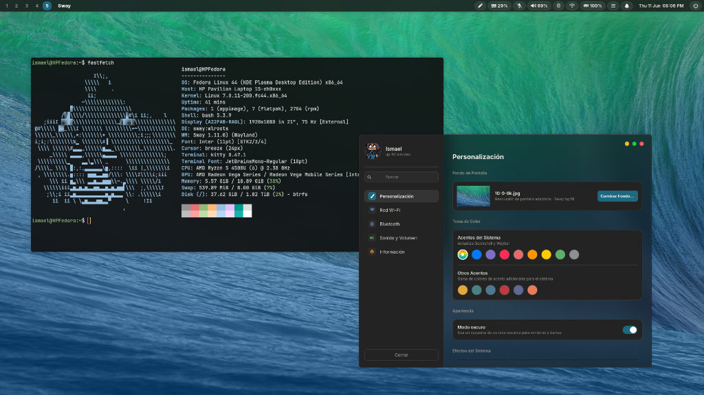

<div align="center">
  <h1>MyNiri Environment v4.0</h1>
  <p><strong>Un entorno premium para Linux construido con Niri y Quickshell.</strong></p>

  
  
  
  
  <br>
  
</div>

---

## Visión General

Este repositorio contiene el setup personal de Ismael. Provee una experiencia de escritorio moderna, robusta y altamente estética diseñada para **Debian** (y compatible con Fedora y Arch). Niri es un compositor de ventanas de mosaico dinámico por desplazamiento infinito en Wayland. Reemplaza los elementos tradicionales de Sway/Tiling por una experiencia fluida de columnas deslizantes e integra componentes gráficos avanzados inspirados en el diseño premium de Honey e iOS, construidos principalmente con `Quickshell` (QML/Qt6).

## Características Principales

### Diseño Unificado y Elegante
* **Quickshell como Motor Principal:** Paneles de volumen, brillo, calendario, menú de apagado, notificaciones y configuración de sistema unificados mediante una sola fuente de verdad (`theme.json`).
* **TopBar QML nativa:** Barra superior con iconos animados (batería con fill por nivel y color, memoria con círculo Canvas de progreso, volumen con barra horizontal 300ms OutCubic, mic con transiciones de color 200ms), diseño Cupertino opcional y visualización minimalista de workspaces agrupados por monitor.
* **Color de Wallpaper Event-Driven:** Al cambiar el fondo, se calcula una sola vez el acento y la luminancia izquierda/derecha, se guarda en `theme.json` y la topbar lo reutiliza sin procesos de análisis permanentes.
* **Arranque instantáneo y optimizado:** Eliminación de retrasos de 25s al arrancar aplicaciones mediante el enmascaramiento automático de `at-spi-dbus-bus.service` y propagación de `NO_AT_BRIDGE=1`.
* **Tematización oscura unificada:** Integración perfecta con el tema oscuro de KDE/Dolphin para todas las aplicaciones Qt5/Qt6 y diálogos nativos mediante `QT_QPA_PLATFORMTHEME=kde` y mejoras en el wrapper `honey`.
* **Soporte Nativo de Modo Oscuro/Claro:** Transiciones dinámicas de colores y contraste inteligente en barras y menús.
* **Geometría Premium (Honey):** Bordes perfectamente redondeados en todas las esquinas y notificaciones sincronizadas dinámicamente con el tema de la shell.
* **Componentes Exclusivos:** Sliders en forma de píldora interactiva sin perillas para control de música, brillo y audio.

### Aplicaciones Integradas
* **Niri Autotiler:** Servicio de autotiling con guard rails porcentuales para evitar columnas angostas con una sola ventana, compatible con pantallas 4:3, 16:10, 16:9 y ultrawide.
* **Settings App (`Super + i`):** Aplicación completa de ajustes en QML con páginas de Conexiones (Wi-Fi/Ethernet/Bluetooth embebidos sin KDE), Audio (selector de sinks con iconos por tipo), Información del Sistema dinámica, y Personalización (colores, animaciones, esquinas, blur y gaps).
* **MemoryDetailPanel:** Panel de monitoreo de RAM con top 10 procesos al hacer clic en el indicador de memoria de la barra.
* **Notificaciones agrupadas estilo macOS:** Agrupación inteligente por app+tipo con badge numérico (+N más). Click en notificación enfoca/abre la app destino.
* **Launcher Moderno (`Ctrl + Space` o `Super + d`):** Reemplazo directo de `Wofi` con una cuadrícula de iconos elegante y responsiva.
* **Power Menu QML:** Menú de apagado y reinicio a medida para Niri, integrado mediante IPC.

### Instalador Inteligente (`installer.sh`)
* **Gestor de Dependencias Autónomo:** Listas de paquetes unificadas y probadas tanto para **Debian/Ubuntu** (apt) como para Fedora (dnf) y Arch Linux (pacman).
* **Compilación Integrada en Debian:** Clona, compila e instala la última versión estable de **Niri**, **xwayland-satellite** (para dar soporte a aplicaciones X11 como Steam y Discord) y **Quickshell** automáticamente desde su código fuente.
* **Gestor de Archivos Flexible:** El instalador pregunta de forma interactiva qué explorador de archivos deseas usar (Dolphin, Nautilus, Thunar, PCManFM, Nemo) y configura tu atajo `Super + e` automáticamente.
* **Payload Auto-Contenido:** Todos los archivos de configuración (`myniri-configs.tar.gz`) están empaquetados en codificación Base64 dentro del mismo instalador. Con ejecutar un archivo, tienes todo el sistema listo.

## Atajos de Teclado Destacados

| Atajo | Acción |
| :--- | :--- |
| `Super + d` o `Ctrl + Space` | Abrir lanzador de aplicaciones (QML) |
| `Super + i` | Abrir configuración del sistema (Settings App) |
| `Super + t` o `Super + Return` | Abrir terminal (`kitty`) |
| `Super + e` | Abrir tu Gestor de Archivos seleccionado |
| `Super + Shift + c` | Recargar la configuración de Niri |
| `Super + z` | Abrir navegador Zen |
| `Super + H` / `Left` | Enfocar columna a la izquierda |
| `Super + L` / `Right` | Enfocar columna a la derecha |
| `Super + K` / `Up` | Enfocar ventana arriba |
| `Super + J` / `Down` | Enfocar ventana abajo |
| `Super + Shift + H` / `Left` | Mover columna a la izquierda |
| `Super + Shift + L` / `Right` | Mover columna a la derecha |
| `Super + Shift + K` / `Up` | Mover ventana arriba (o a workspace arriba) |
| `Super + Shift + J` / `Down` | Mover ventana abajo (o a workspace abajo) |
| `Super + 1-10` | Cambiar al workspace 1-10 |
| `Super + Shift + 1-10` | Mover columna activa al workspace 1-10 |
| `Super + Ctrl + Right / Left` | Navegar al workspace siguiente / anterior |
| `Super + F` | Maximizar columna activa |
| `Super + Shift + Space` o `F` | Cambiar ventana activa a flotante |
| `Super + Shift + Return` | Abrir terminal flotante |
| `Clic en memoria (TopBar)` | Abrir panel de top 10 procesos RAM |

## Instalación

1. Clona o descarga este repositorio.
2. Asegúrate de tener permisos de ejecución en el instalador:
   ```bash
   chmod +x installer.sh
   ```
3. Ejecuta el instalador (no uses `sudo`, el script lo pedirá cuando sea necesario):
   ```bash
   ./installer.sh
   ```
4. Elige tu gestor de archivos cuando el instalador lo pregunte.
5. Una vez completado, cierra sesión e inicia en tu nuevo entorno seleccionando **Niri** en tu pantalla de login.

---
*Creado y mantenido por Ismael.*
